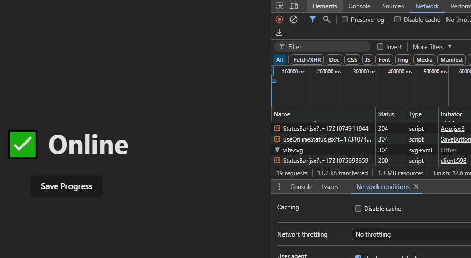

# Custom Hooks

Este projeto, foi criado para aprender a criar um custom hook (hook personalizado). Vamos criar um projetinho, que vai verificar quando o usuário fica offline e envia um aviso na tela.

Vamos ter 2 componentes que verifica no evento global, a conexão com a internet, utilizando o useState e useEffect. Esses 2 componentes precisam do mesmo trecho de código pra isso, portanto, será criado o hook personalizado pra aproveitar este trecho de código em ambos os componentes.

## Anotações

Foi anotado o passo a passo deste projeto, na página React Avançado > Custom Hooks - Hooks personalizados

### Projeto funcionando
